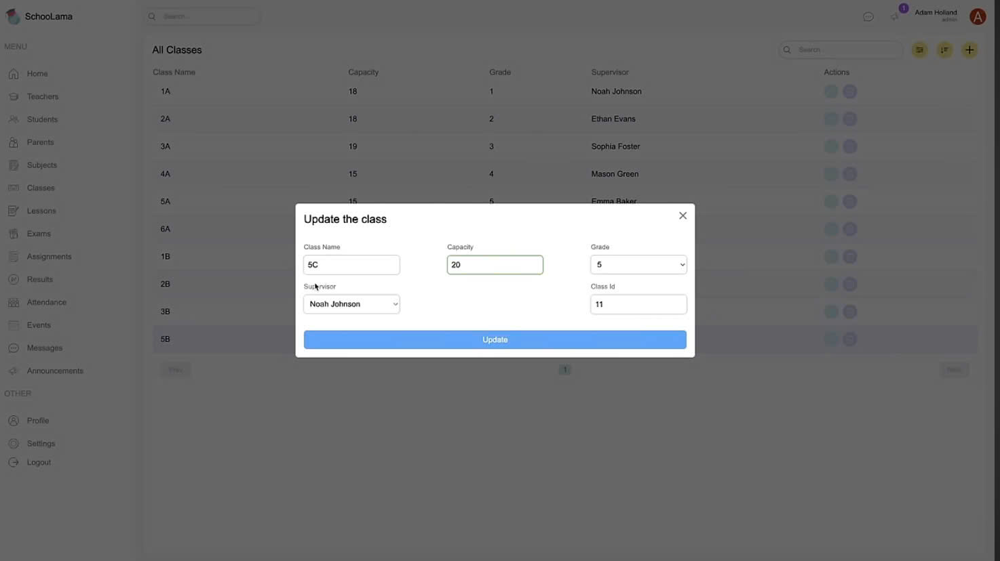

# Web quản lí trường học
-Mỗi giáo và học sinh được cấp 1 tài khoản riêng
Giao diện Đăng nhập 

Bên Phía admin trưòng học khi Đăng nhập

Còn bên phía Giáo viên khi đăng nhập

Bên Phía Admin trường ta sẽ được show danh sách giáo viên

Danh sách môn học

Danh sách các lớp

Admin có thể thếm học Sinh và giáo viên
 
  
Và thêm xóa sửa tất cả tài khoản giáo viên
  
Giao Diện Khi học sinh đăng nhập
  
- học sinh có thể xem điểm và xem các sự kiện trường thông qua đây
  
  Thông báo
  

